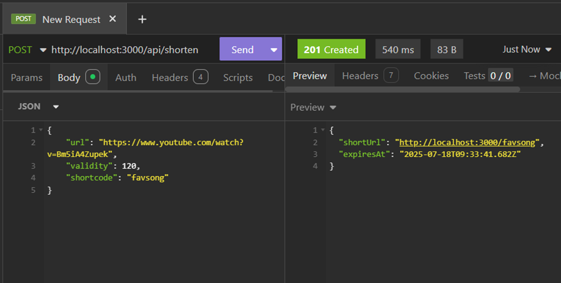
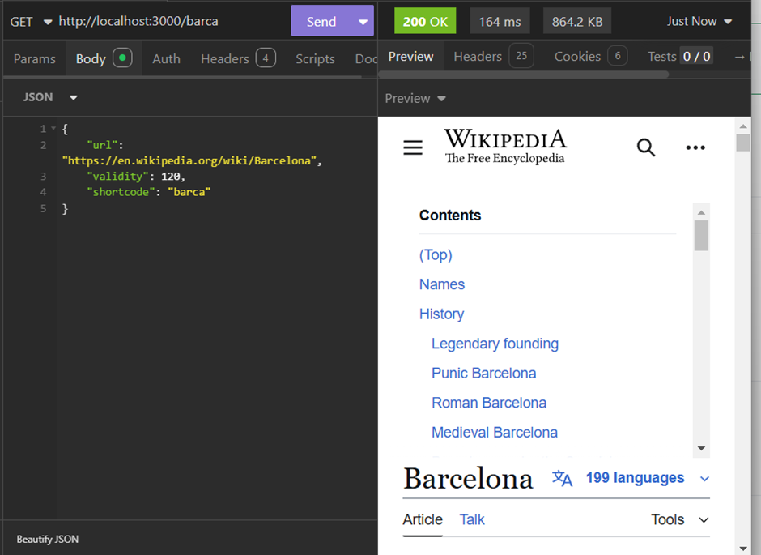
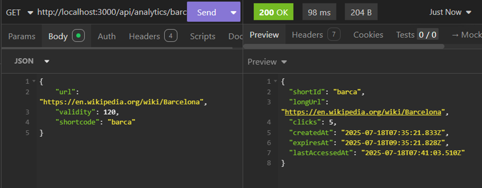

# 22VE1A05K5

An Express microservice to shortern urls

# URL Shortener Microservice

This is a simple URL shortener microservice built with Express.js and the native MongoDB driver, featuring URL shortening, redirection, analytics, and structured logging.

## API Endpoints Showcase

### 1. Shorten URL

This endpoint allows you to convert a long URL into a short, manageable one, with optional validity and custom shortcodes.

### 2. Get Long URL (Redirection)

When a user accesses a shortened URL, they are redirected to the original long URL.

### 3. Short ID Analytics

Retrieve detailed usage statistics for any shortened URL, including click counts, creation/expiry dates, and last access time.

